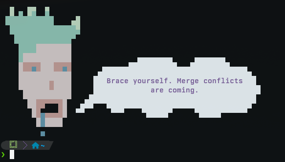

# jestsay


jestsay - cowsay+fortune with a twist

Overlays text onto ANSI art images with proper-ish color handling.

This is just some fun ai slop with a human touch.

## Usage

    jestsay [OPTIONS]

## Options

- `--jester FILE` - Path to ANSI art file
- `--quips FILE` - Path to quips file
- `--x-offset INT` - Horizontal position for text start
- `--y-offset INT` - Vertical position for text start
- `--width INT` - Width of text area
- `--height INT` - Number of text lines
- `--align [left|center|right]` - Text alignment
- `--color HEX` - Text color as hex code
- `--no-bold` - Disable bold text

## Examples



## Install

```
❯ git clone git@github.com:UmBsublime/jestsay.git && cd jestsay

❯ ./install.sh --help
Usage: ./install.sh [OPTIONS]

Install jestsay to your system.

OPTIONS:
    -p, --prefix DIR      Installation prefix (default: ~/.local)
    -d, --data-dir DIR    Data directory (default: ~/.local/share/jestsay)
    -s, --system          Install system-wide (requires sudo)
    -f, --force           Overwrite existing installation
    -h, --help            Show this help message

ENVIRONMENT:
    PREFIX                Installation prefix
    INSTALL_DIR           Binary installation directory
    XDG_DATA_HOME         XDG data directory (used to determine data location)

EXAMPLES:
    # Install to ~/.local (default)
    ./install.sh

    # Install system-wide
    sudo ./install.sh --system

    # Install to custom location
    PREFIX=/opt/jestsay ./install.sh
```

## Uninstall

```
❯ ./uninstall.sh --help
Usage: ./uninstall.sh [OPTIONS]

Uninstall jestsay from your system.

OPTIONS:
    -p, --prefix DIR      Installation prefix (default: ~/.local)
    -d, --data-dir DIR    Data directory (default: ~/.local/share/jestsay)
    -s, --system          Uninstall system-wide (requires sudo)
    -y, --yes             Skip confirmation
    -h, --help            Show this help message
```


